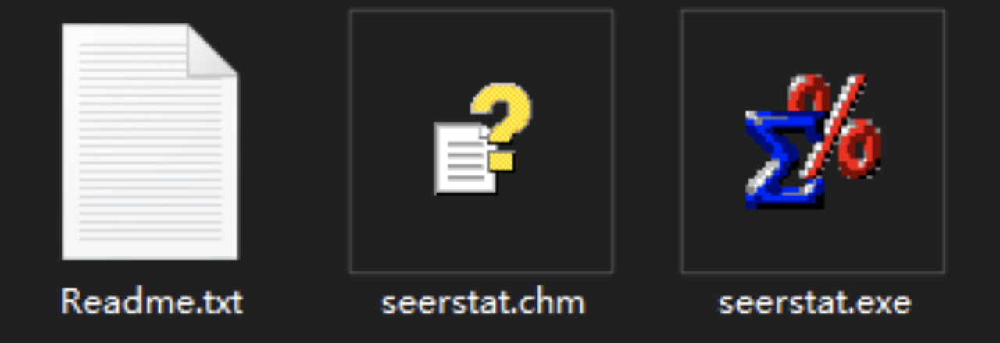
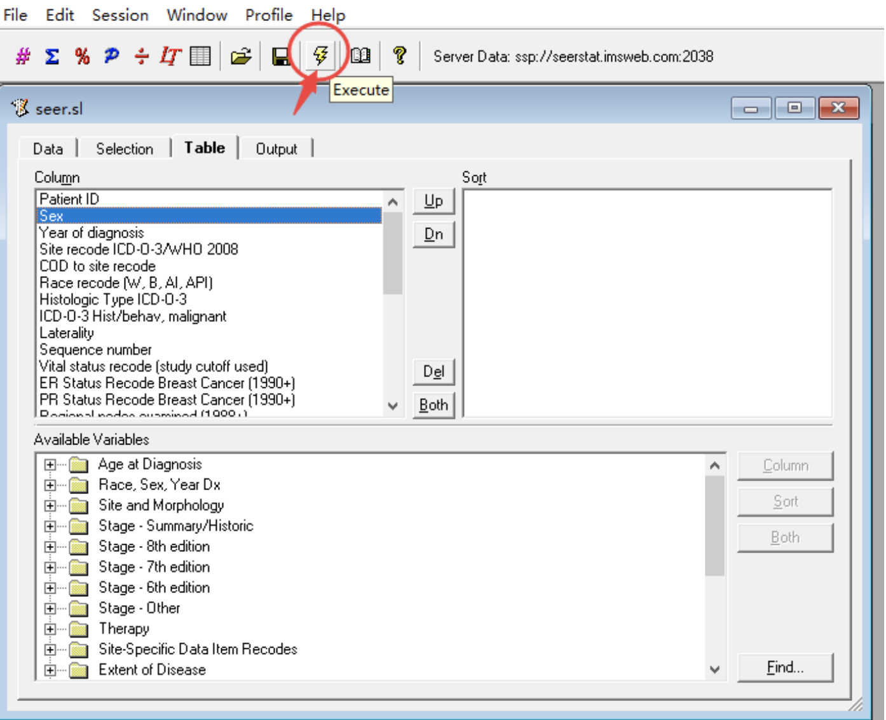

.. _downloading_seer:

Getting the SEER dataset
========================

.. currentmodule:: hazardous

SEER is a reference dataset for cancer statistics in the US, used in competitive risk analysis.

Below is a quick guide to obtain it.
Note that you will need a **Windows computer** (or emulator) to download the files.

1. Head to the `SEER data access webpage <https://seerdataaccess.cancer.gov/seer-data-access>`_, enter your email address and click on "Research Data Requests".
2. Fill the form.
3. Confirm your email address and wait a few days before the confirmation.
4. After receiving the confirmation email, go to the `SEER*Stat Software webpage <https://seer.cancer.gov/seerstat/software/>`_ to download the software on Windows.
5. Open it and sign in with your SEER credendials received by email.

.. raw:: html

     

6. Use seerstat to open the `data/seer.sl` file.

.. raw:: html

     

You should get a txt file. This file can be loaded using :func:`hazardous.data.load_seer`.

.. raw:: html

     

