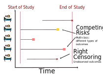

.. hazardous documentation master file, created by
   sphinx-quickstart on Fri Jun  2 10:47:19 2023.
   You can adapt this file completely to your liking, but it should at least
   contain the root `toctree` directive.

HΛZΛRDOUS
=========

Survival Analysis with Competing Risks
-------------------------------------------------------

.. container:: index-features

   * Survival Analysis, Competing Risks

   * scikit-learn compatible

   * scalable gradient boosting

**hazardous** is a Python library for **survival analysis** -i.e. time-to-event prediction- 
and **competing risks** settings. It introduces **SurvivalBoost**, a **scalable**
gradient-boosting model designed for this task.

With a **scikit-learn-compatible API**, the library also ships a suite of
evaluation metrics specifically adapted to the **competing risks** setting.

What is the difference between Survival Analysis and the Competing risks setting?
---------------------------------------------------------------------------------
In contrast to the Survival Analysis setting, the Competing Risks setting accounts
for the possibility that multiple event of interest may occur,
not just a single event.

It focuses on predicting which event will occur first and when, based on data where
some events have not yet been observed.

What is SurvivalBoost?
----------------------
**SurvivalBoost** is **a gradient-boosting variant**, that offers prediction for
survival and competing risks settings, fully compatible with
`scikit-learn <https://scikit-learn.org>`_. It can be used with
scikit-learn tools such as pipelines, column transformers,
cross-validation, hyper-parameter search tools, etc.
Using a novel strictly proper scoring rule, the model is trained to predict the
cumulative incidence function and the survival function at any horizon.
SurvivalBoost puts a focus on predictive the accuracy -defined as the ability to predict 
the observed event- rather than on inference. 

Additional theoretical details about the model can be found in `Survival Models:
Proper Scoring Rule and Stochastic Optimization with Competing Risks
<https://hal.science/hal-04617672v5/document>`_.

Evaluating competing-risks models
---------------------------------

A trustworthy model has to get three different things right: **rank** patients
by risk, **predict the right probabilities**, and stay **calibrated** across the
whole follow-up. ``hazardous`` provides one family of metrics for each question.

.. grid:: 1 1 3 3
   :gutter: 3

   .. grid-item-card:: Discrimination

      **C-index for competing risks**
      This metric can be used to answer the question:
      *Does the model rank individuals in the right order*
      +++
      See :func:`~hazardous.metrics.concordance_index_incidence`

   .. grid-item-card:: Accuracy

      **Integrated Brier Score (IBS)**
      This metric can be used to answer the question:
      *Are the predicted probabilities close to the observed outcomes?*
      
      **Accuracy in Time**
      This metric can be used to answer the question:
      *Is the current predicted class correct?* 

      +++
      See :func:`~hazardous.metrics.integrated_brier_score_incidence`, 
      :func:`~hazardous.metrics.brier_score_incidence` and 
      :func:`~hazardous.metrics.accuracy_in_time`

   .. grid-item-card:: Calibration

      **AJ & KM calibration**

      *Are the predicted probabilities trustworthy on average?* 
      +++
      See :func:`~hazardous.metrics.aj_calibration` and
      :func:`~hazardous.metrics.km_calibration`

.. seealso::

   The library relies on `lifelines <https://lifelines.readthedocs.io/en/latest/>`_ 
   for the Kaplan-Meier estimator used in SurvivalBoost. We extend our gratitude to
   the authors of lifelines for their significant contributions to the survival
   analysis community, including the implementation of models such as
   the Kaplan-Meier, Cox model, and Aalen-Johansen, as well as metrics
   like the C-index and Brier Score.

.. note::
   Quantifying the statistical association or causal effect of covariates on the
   cumulative event incidence or instantaneous hazard rate is currently beyond
   the scope of this library.

- License: MIT
- GitHub repository: https://github.com/soda-inria/hazardous
- Changelog: https://github.com/soda-inria/hazardous/blob/main/CHANGES.rst
- Status: under development, API is subject to change without notice.

.. currentmodule:: hazardous

.. toctree::
   :maxdepth: 2
   :caption: Contents:

   install
   api
   auto_examples/index
   downloading_seer
