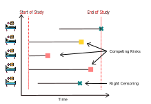

.. hazardous documentation master file, created by
   sphinx-quickstart on Fri Jun  2 10:47:19 2023.
   You can adapt this file completely to your liking, but it should at least
   contain the root `toctree` directive.

HΛZΛRDOUS
=========

Gradient-boosting Survival Analysis and Competing Risks
-------------------------------------------------------

.. container:: index-features

   * Survival Analysis, Competing Risks

   * scikit-learn compatible

   * scalable gradient boosting

**hazardous** is a Python library for **survival analysis - i.e. time-to-event prediction - 
and competing risks** predictions. The model proposed in this library is
a **scalable** gradient-boosting called **SurvivalBoost**.

With a **scikit-learn compatible API**, we also provide different useful
metrics for the evaluation of the model such as the **Integrated Brier Score**
or the **C-index** adapted for competing risks setting.

What is the difference between Survival Analysis and the Competing risks setting?
-------------------------------------
Compared to the Survival Analysis setting, the Competing Risks setting
considers that the event of interest is not the only event of interest 
that may happen.
Predicting which event will happen first, and when, from data where some
events have not yet been observed:

What is SurvivalBoost?
----------------------
**SurvivalBoost** is **a gradient-boosting variant**, that offers prediction for
survival and competing risks settings, fully compatible with
`scikit-learn <https://scikit-learn.org>`_. It can be used with
scikit-learn tools such as pipelines, column transformers,
cross-validation, hyper-parameter search tools, etc.
Using a novel strictly proper scoring rule, the model is trained to predict the
cumulative incidence function and the survival function at any horizon.
SurvivalBoost puts a focus on predictive the accuracy -defined as the ability to predict 
the observed event- rather than on inference. 

More information about the theory behind the model is described in `Survival Models:
Proper Scoring Rule and Stochastic Optimization with Competing Risks
<https://arxiv.org/pdf/2410.16765>`_.

.. seealso::

   The library depends on `lifelines <https://lifelines.readthedocs.io/en/latest/>`_ 
   for the Kaplan-Meier estimator used in SurvivalBoost. We thank the authors of 
   lifelines for their work and their contribution to the community of survival analysis
   with the implementation of models -e.g. Kaplan-Meier, Cox model, Aalen-Johansen- and
   metrics -e.g. C-index, Brier Score-.

.. note::
   Quantifying the statistical association or causal effect of covariates with/on
   the cumulated event incidence or instantaneous hazard rate is not in the scope
   of this library at this time.

- License: MIT
- GitHub repository: https://github.com/soda-inria/hazardous
- Changelog: https://github.com/soda-inria/hazardous/blob/main/CHANGES.rst
- Status: under development, API is subject to change without notice.

.. currentmodule:: hazardous

.. toctree::
   :maxdepth: 2
   :caption: Contents:

   api
   auto_examples/index
   downloading_seer
